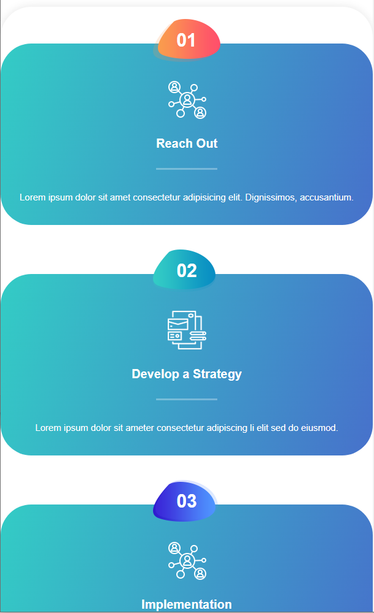
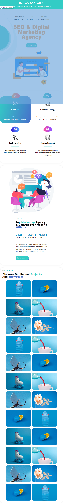

# examen syntra-html 2022

## Examen Opdracht

- maak het design na
- werk van buiten naar binnen
- neem de tijd om te analyseren wat je allemaal moet doen om het design / layout na te bouwen
- als er iets niet duidelijk is, gelieve op tijd vragen te stellen
- het is een open boek dus je kan documentatie / resources online opzoeken
- maar er wordt geen plagiaat of samenwerking toegelaten: **heb je een vraag, dan stel je die aan mij**
- je pusht je examen opdracht ook niet op een publieke repo op GitHub (private mag)
- je deployt je examen opdracht niet online

## Gegeven

- initiëel was het de bedoeling enkel CSS aan te passen, maar als je het toch nodig vind om HTML bestand aan te passen, mag dat zeker. Echter:
  - verander sowieso niet de bestandstructuur van het project noch de html structuur
  - klasses toevoegen kan, dat is op zich geen probleem
  - heb je een goeie reden om iets anders dan klasses / ids aan te passen, neem even contact met mij op
- je krijgt alle afbeeldingen & fonts, die bevinden zich in het mapje `assets`
  - gebruikte font: `font-family: Open Sans", sans-serif;`
  - voor de vetgedrukte titels gebruiken we `font-weight: 800;`, behalve "About Us" is het iets minder bold: `font-weight: 700;`
  - voor de afbeeldingen zou het moeten duidelijk zijn wat waar gebruikt wordt; indien niet duidelijk, vraag het aan mij
  - je krijgt alle kleur codes reeds (ze staan als variabelen in het css startbestand `stijl.css`)
- ik ga niet te streng zijn op al dan niet pixel perfect design
- verzeker je ervan dat je volgende zaken prioritiseert:
  - navigatie
  - header
  - section#features

en dan de rest

## Indienen

Je dient je CSS bestand (en eventuele HTML bestand als je die hebt aangepast) in een .zip file `syntra_html-css_2022_[naam].zip`, bv.: `stijl_karim.css`

- Zorg ervoor dat je naam & voornaam duidelijk in commentaar in het CSS bestand geschreven staat.
- Heb je ook HTML aangepast, zorg ervoor dat je naam & voornaam duidelijk in commentaar in het HTML bestand geschreven staat.
- Zorg er ook voor dat je naam te zien is in de HTML, vanboven; zie screenshot (ipv `Karim's SEOLAB` komt hier je `[eigen naam]'s SEOLAB`) - hiervoor ga je pseudo elementen moeten gebruiken en schrijf je naam niet zelf in de HTML maar met CSS !!!

## Hints / Opgave

- om op een element, verschillende child elements te laten reageren op de status (bv. `:hover`) van de parent moet je een bijzondere selector schrijven - in de [FAQ page](https://goldflow.github.io/website-productie/faq/#i-want-that-a-child-element-only-changes-when-its-parent-is-hovered-on-but-not-when-i-hover-on-the-child-only-how-do-i-do-this) staat in een van de eerste vragen dit beschreven - je zal dit nodig hebben voor de features sectie
- voor de features sectie ga je ook de witte afbeeldingen moeten gebruik on hover ipv de zwarte
- je moet background-image gebruiken om bepaalde afbeeldingen erin te krijgen gezien je de html zelf niet op die manier mag aanpassen
- scroll zeker ook hier naar beneden om te zien hoe de #features er uitzien als je met je muis erover gaat - als transition overal `300ms ease-out` gebruikt - zie sectie #features
- voor de buttons & de main sections is er box-shadow gebruikt; geen border; voor sections krijg je mee: `box-shadow: 0 0 15px rgb(0 0 0 / 10%)`
- om een element absoluut te positioneren (bv de nummers met kleurtjes in de #features sectie), kan het zijn dat je volgende gaat moet gebruiken om die ook te kunnen centreren [when-using-absolute-position-how-to-center-that-element](https://goldflow.github.io/website-productie/faq/#when-using-absolute-position-how-to-center-that-element)
- je zal `text-transform: capitalize;` & `text-transform: uppercase` nodig hebben
- switchen van zwart naar wit van de images bij `#features`, kan gewoon door de witte image variant te gebruiken die zich ook in de assets bevind `assets\images\features-icon-white-01.png`
- sommige kleuren / lettertypes / groottes zijn hetzelfde over de hele layout; je kan je CSS vereenvoudigen door met variabelen te werken ([link](https://www.w3schools.com/css/css3_variables.asp))
- om de buttons te stylen ga je een paar standaard css properties moeten resetten (die zijn niet gereset door `reset.css`), meerbepaald de border
- achtergrond van de `features`-sectie zijn gedaan met gradients, zie [hier](https://www.w3schools.com/css/css3_gradients.asp) hoe
- je zal 1 media query moeten gebruiken die het volgende doet:
    1. op het breekpunt wanneer `SEO & Digital Marketing Agency` & de afbeelding ernaast onder elkaar komen, dan moet je er ook voor zorgen dat: `SEO & Digital Marketing Agency` & de groene knop `Get a quote` alletwee gecentreerd worden ipv links uitgelijnd
    2. de achtergrond `banner-dec-right.png` moet verdwijnen op dat zelfde breekpunt (zie GIF)
    3. de lijn boven `SEO & Digital Marketing Agency` moet de kleur `lightgrey` krijgen ipv wit
    4. de blauwe knop met `Get a quote` in de `nav` moet verdwijnen (dit kan je doen met `display: none`)
    5. verwijder witruimte rond `div#container`

## troubleshooting 101

- don't panic
- typ geen classenamen of id's over; kopïeer ze - zodat je geen uren zit te zoeken wegens een typfout
- probeer het eerst eens uit in isolatie: op W3Schools (try it) of CodePen
  - gebruik Developer Tools om:
    - zaken meteen in de browser aan te passen
    - Grid/Flex te begrijpen
    - begrijpen welke styles andere styles overschrijven
    - via Computed Box model te begrijpen hoe je layout word aangepast

- bekijk zeker ook de links in slack en [FAQ page](https://goldflow.github.io/website-productie/faq/)
- en als je vastzit, wees niet verlegen om voor toelichting - hulp te vragen

## voor brownie points

> je krijgt hier geen extra punten voor maar wel een high-five ;)
> doe dit pas als je met alles klaar bent

- voor de achtergrond afbeelding: je mag gerust enkel `banner-dec-right.png` gebruiken maar voor brownie points: het `main` element heeft 2 verschillende background-images die los van elkaar bewegen (zie GIF)
  - om de een over de ander te laten gaan moet je spelen met `z-index`
  - om 2 verschillende achtergronden te plaatsen kan je werken met `:after` & `:before`
  - ter herhaling, het is even goed om 1 te hebben
- probeer (indien mogelijk met voorbedachte rade), zoveel mogelijk lijntjes css te hergebruiken door selectors te combineren
- gebruik `:has` en `:is` om je code nog verder te optimaliseren
- gebruik `var()` en globaal gedefiniëerde waardes om eenmalig parameters in te stellen zodat je die later ook in 1 keer moet aanpassen (bv. kleur, lettergroottes, witruimtes)
- voor de features sectie ga je ook de witte afbeeldingen moeten gebruik on hover ipv de zwarte - maar je kan ook ipv witte afbeelding werken met een andere truuk (om zonder extra afbeelding, de bestaande zwarte afbeelding te veranderen naar wit - zo heb ik het ook gedaan)

## visual help

### features overview when hovering

belangrijk hier dat de icons buiten het element komen te staan

hiervoor kan je absolute positioning gebruiken; heb hiervoor een link toevoegd op de [FAQ page](https://goldflow.github.io/website-productie/faq/)

### Quick Overview

### Navigation & Header media query / responsive demo

### Portfolio responsive Gallery

### Quick Responsive Overview

### Responsive Overview

mobile:

tablet:

