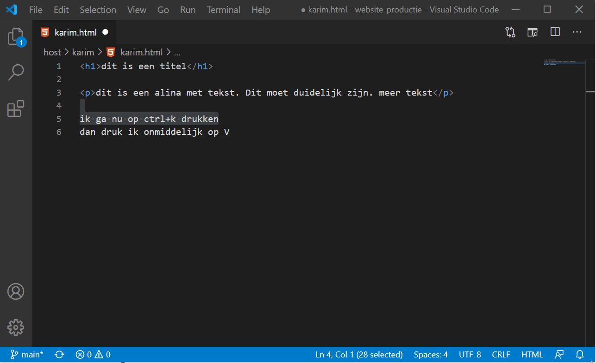

# Les 1: Introductie HTML & CSS

## Het verhaal van uw eerste website

Er steekt veel werk in een professionele website, dus als je nog niet veel over webontwikkeling weet, adviseren we je om klein te beginnen. Je zult niet onmiddellijk een nieuwe Facebook maken, maar het is niet moeilijk om uw eigen eenvoudige website online te krijgen, dus zullen we daarmee beginnen.

We beginnen met enkele praktische grondsbeginselen van Web Design. [Klik hier om deze te bekijken](../basis/basis.md)

## HTML Introductie

HTML is, in zijn kern, een vrij eenvoudige taal. Hij bestaat uit elementen die kunnen worden toegepast op stukken tekst om hen een nieuwe betekenis in een document te geven (is de tekst een paragraaf? een ongeordende lijst? een onderdeel van een tabel?). Met HTML kan je een document ook in logische secties structureren (heeft het een koptekst? drie kolommen met inhoud? een navigatiemenu?) en je kan inhoud zoals afbeeldingen en video's in een pagina integreren. Deze module is een inleiding op de eerste twee aspecten van HTML en introduceert fundamentele begrippen en syntaxis, die je nodig hebt om HTML te begrijpen.

## Wat is HTML?

[HTML](https://developer.mozilla.org/nl/docs/Glossary/HTML) (HyperText Markup Language) is geen programmeertaal; het is _een opmaaktaal_ en hij wordt gebruikt om je browser te vertellen hoe de webpagina's die je bezoekt, moeten worden weergegeven. Het kan even simpel of ingewikkeld zijn als de webontwerper dat wenst. HTML bestaat uit een serie [elementen](https://developer.mozilla.org/nl/docs/Glossary/Element), die je kan gebruiken om verschillende onderdelen van je inhoud te verpakken zodat die er op een bepaalde manier gaat uitzien of zich gedragen. De [tags](https://developer.mozilla.org/nl/docs/Glossary/Tag) (een ander woord voor labels of markeerders) die de tekst insluiten kunnen van een woord of een afbeelding een hyperlink naar ergens anders maken, ze kunnen woorden cursiveren, lettertypes vergroten of verkleinen enzovoort. Neem bijvoorbeeld de volgende regel tekst:

```
My cat is very grumpy
```

Stel dat we van deze regel een paragraaf wilden maken, dan zouden we dat doen door deze regel met ([`<p>`](https://developer.mozilla.org/nl/docs/Web/HTML/Element/p "Het <p>-element van HTML vertegenwoordigt een paragraaf van tekst. Paragrafen worden meestal vertegenwoordigd in visuele media als blokken tekst, die worden gescheiden van aangrenzende blokken door verticale witruimte en/of inspringing op de eerste regel. Paragrafen zijn elementen op blokniveau.")) paragraaflabels te omhullen:

```html
<p>My cat is very grumpy</p>
```

## Anatomie van een HTML-element

We gaan dit paragraafelement wat verder onderzoeken:


De belangrijkste onderdelen van ons element zijn:

1.  **De opening tag:** (het openingslabel) Deze bestaat uit de naam van het element (in dit geval p), ingesloten door kleiner- en groter-dan-tekens. <elementnaam> toont ons waar het element en zijn invloed op de inhoud begint. In dit geval duidt het het begin van de paragraaf aan.
2.  **De closing tag:**  (het eindlabel) Die is identiek aan de opening tag, behalve dat er ook nog een schuine streep voor de naam van het element staat. De schuine streep leunt naar voor en staat net achter <. Het eindlabel duidt het einde van het element aan, in dit geval dus het einde van de paragraaf.  Beginners vergeten de eindmarkeerder nogal eens en dat kan tot vreemde resultaten leiden.
3.  **De content:** (de inhoud) Dit is de inhoud van het element, in dit geval gewoon een regel tekst. 
4.  **Het element:** De openingsmarkeerder plus de eindmarkeerder plus de inhoud zijn gelijk aan het element.

### Oefening: Actief leren HTML tag te schrijven

Ga naar [deze link](https://developer.mozilla.org/nl/docs/Learn/HTML/Introduction_to_HTML/Getting_started#Actief_leren_cre%C3%ABr_je_eerste_HTML-element) om een oefening te maken op een HTML tag

### Geneste Elementen

Je kan elementen in andere elementen steken - we noemen dit **nesten**. Als we willen zeggen dat our cat VERY grumpy is, kunnen we het woord "very" in een `<strong>`-element insluiten. Dat zorgt ervoor dat het woord wordt beklemtoond:

```html
<p>My cat is <strong>very</strong> grumpy.</p>
```

Je moet er echter wel voor zorgen dat je elementen correct worden genest: in het voorbeeld hierboven openden we het  `<p>`-element eerst en dan het `<strong>`-element.  Dus moeten we `<strong>` eerst sluiten en dan `<p>`. Het volgende is fout:

```html
<p>My cat is <strong>very grumpy.</p></strong>
```

De elementen moeten correct worden geopend en gesloten zodat ze duidelijk in of buiten elkaar bestaan. Als ze overlappen zoals hierboven, zal de webbrowser proberen te raden wat je wil zeggen en dat kan heel onverwachte resultaten opleveren. Doe dat dus niet!

Juist:

```html
<p>My cat is <strong>very grumpy.</strong></p>
```

### Blok- versus inline-elementen

Elementen in HTML kunnen in twee belangrijke categorieën worden ingedeeld: elementen die als een blok functioneren en inline-elementen.

* Elementen op blokniveau vormen een zichtbaar blok op de pagina — wat er ook aan vooraf ging, ze volgen op een nieuwe lijn en elke inhoud die erna komt zal ook op een nieuwe lijn staan. Zulke elementen zijn meestal structurele elementen in de pagina. Ze zijn bijv. paragrafen, lijsten, menu's, voetteksten enz. Een blokelement zal niet in een inline-element worden genest maar het kan wel in een ander blokelement worden genest. 
* Inline-elementen bestaan binnen elementen op blokniveau. Ze worden rond kleine delen van de inhoud geplaatst en dus niet rond volledige paragrafen en andere vormen van gegroepeerde inhoud. Ze zullen eerder in een paragraaf of tekst terechtkomen, bijvoorbeeld [`<em>`](https://developer.mozilla.org/nl/docs/Web/HTML/Element/em "The documentation about this has not yet been written; please consider contributing!") of [`<strong>`](https://developer.mozilla.org/nl/docs/Web/HTML/Element/strong) kan je in een [`<a>`](https://developer.mozilla.org/nl/docs/Web/HTML/Element/a "Het HTML <a> element (of anker element) maakt een hyperlink naar andere web pagina's, bestanden, lokaties binnen dezelfde pagina, email-adressen of een andere URL.")-element (hyperlink) zetten om het element te benadrukken.

Bekijk het volgende voorbeeld eens:

```html
<em>eerste</em><em>tweede</em><em>derde</em>

<p>vierde</p><p>vijfde</p><p>zesde</p>
```

### Lege elementen

Niet alle elementen volgen hetzelfde patroon met een openingslabel, inhoud en eindlabel. Sommige elementen bestaan uit één enkel label, dat meestal wordt gebruikt om iets in de inhoud in te voegen/in te bedden. Het [``](https://developer.mozilla.org/nl/docs/Web/HTML/Element/img "The documentation about this has not yet been written; please consider contributing!")-element bijvoorbeeld voegt een afbeelding aan de pagina toe op de plaats waar het het element in de code is geplaatst:

```html

```


## Attributen

Elementen kunnen ook attributen krijgen die er zo uitzien:


Attributen bevatten extra informatie over het element die je niet in de inhoud van dat element wil zien. In dit voorbeeld zie het class (klasse dus) attribuut dat je kan gebruiken om het element een naam te geven. Daarmee kan je het identificeren en er onder andere stijlinformatie op richten.

Een attribuut bestaat uit:

1.  Een spatie tussen het attribuut en de elementnaam (of het vorige attribuut als het element al een of meer attributen heeft).
2.  De attribuutnaam, gevolgd door een is-gelijk-aan-teken (=).
3.  Een attribuutwaarde tussen aanhalingstekens.

### Actief leren: Attributen aan een element toevoegen

[`<a>`](https://developer.mozilla.org/nl/docs/Web/HTML/Element/a "Het HTML <a> element (of anker element) maakt een hyperlink naar andere web pagina's, bestanden, lokaties binnen dezelfde pagina, email-adressen of een andere URL.") is ook een element — het vertegenwoordigt een anker en verandert de tekst die het insluit in een hyperlink. Dit element kan een aantal attributen krijgen, twee ervan zijn de volgende:

* `href`: De waarde van dit attribuut is het webadres waar je de link naar wil doen wijzen en waar de browser naartoe navigeert als er op de link wordt geklikt. Bijvoorbeeld:  `href="https://www.mozilla.org/"`.
* `title`: Dit attribuut verschaft exta informatie over de link, zoals de aard van de pagina waarmee het anker ons verbindt. Bijvoorbeeld: `title="The Mozilla homepage"`. Dit attribuut zal als een tooltip verschijnen als de muis erover heen beweegt.

Bewerk de regel in het _invoer-gebied_ hieronder en verander hem in een hyperlink naar je favoriete website. Eerst voeg je het `<a>-`element toe, dan het `href-`attribuut en dan het `title-`attribuut. Je zal de verandering live kunnen updaten in het _uitvoer-gebied_. Je zou een link moeten zien die de inhoud van het `title`-attribuut toont als je met je muis over de link heen glijdt. Als je erop klikt zou je naar het webadres moeten worden gebracht dat in het href-element staat. Vergeet niet dat je een spatie tussen de elementnaam en elk attribuut moet plaatsen.

### Oefening: HTML Preview gebruiken

#### Voor je begint

Vergeet niet HTML Preview extensie te installeren. Dat doe je op deze manier:


#### Gebruik van HTML Preview

Vervolgens om te zien wat je verandert, open je html file en vervolgens druk je op:

    CTRL+"k" dan druk je op "v" (windows)
    CMD+"k" dan druk je op "v" (MAC)

Je kan hier zien hoe je dat doet:




### Een link maken of anchor (anker) element

[`<a>`](https://developer.mozilla.org/nl/docs/Web/HTML/Element/a "Het HTML <a> element (of anker element) maakt een hyperlink naar andere web pagina's, bestanden, lokaties binnen dezelfde pagina, email-adressen of een andere URL.") is ook een element — het vertegenwoordigt een anker en verandert de tekst die het insluit in een hyperlink. Dit element kan een aantal attributen krijgen, twee ervan zijn de volgende:

* `href`: De waarde van dit attribuut is het webadres waar je de link naar wil doen wijzen en waar de browser naartoe navigeert als er op de link wordt geklikt. Bijvoorbeeld:  `href="https://www.mozilla.org/"`.
* `title`: Dit attribuut verschaft exta informatie over de link, zoals de aard van de pagina waarmee het anker ons verbindt. Bijvoorbeeld: `title="The Mozilla homepage"`. Dit attribuut zal als een tooltip verschijnen als de muis erover heen beweegt.

### OPDRACHT: attributen (link)

We hebben gezien wat opening & closing tags zijn en wat een element is (de tags + de inhoud tussen de tags).

We hebben in het vorige hoofdstuk ook gezien wat een attribuut is. De bedoeling is nu dat we bij dit stuk html een link toevoegen:

  `<p> link naar een tekst </p>`

Maak een nieuw html bestand:
Druk op File > New, vervolgens doe je onmiddelijk: File > Save As.

- het moet eindigen op .html
- er mogen geen spaties of speciale tekens
- alles in lower case
- je eigen naam moet er in voorkomen

bv:
    link_opdracht_karim.html

Eenmaal je het bestand hebt opgeslaan, open je de bijhorende preview zoals beschreven in het hoofdstuk: Gebruik van HTML Preview

 Verander deze code in een hyperlink naar je favoriete website.
 
   `<p> link naar een tekst </p>`
   
 Eerst voeg je het `<a>-`element toe, dan het `href-`attribuut en dan het `title-`attribuut. Je zal de verandering live kunnen updaten in het _uitvoer-gebied_. Je zou een link moeten zien die de inhoud van het `title`-attribuut toont als je met je muis over de link heen glijdt. Als je erop klikt zou je naar het webadres moeten worden gebracht dat in het href-element staat. Vergeet niet dat je een spatie tussen de elementnaam en elk attribuut moet plaatsen.


## Anatomie van een HTML-document

Daarmee kunnen we onze inleiding op individuele HTML-elementen afsluiten.  Op hun eentje zijn ze echter niet erg nuttig. Nu gaan we zien hoe individuele elementen gecombineerd worden om een volledige HTML-pagina te vormen:

```
<!DOCTYPE html>
<html>
  <head>
    <meta charset="utf-8">
    <title>Mijn testpagina</title>
  </head>
  <body>
    <p>Dit is mijn pagina</p>
  </body>
</html>
```

Wat steekt er in die pagina?

1.  `<!DOCTYPE html>`: het doctype. Lang geleden was HTML jong (rond 1991/2). Doctypes moesten toen als links naar een serie regels dienen. De HTML-pagina moest die regels volgen om als goede HTML te kunnen worden beschouwd. Dat kon automatische foutcontrole zijn en andere nuttige zaken. Ze zagen er toen ongeveer zo uit:
2.  ```
    <!DOCTYPE html PUBLIC "-//W3C//DTD XHTML 1.0 Transitional//EN"
    "http://www.w3.org/TR/xhtml1/DTD/xhtml1-transitional.dtd">
    ```

      Maar tegenwoordig trekt niemand zich nog iets van die regels aan. Ze zijn enkel nog een historisch artefact dat erin moet staan opdat alles correct zou werken. `<!DOCTYPE html>` is de kortste tekenserie die als een geldig doctype kan dienen; voorlopig is dat al dat je moet weten.

3.  `<html></html>`: Het `<html>-`element. element sluit alle inhoud op de volledige pagina in en wordt ook het root-element genoemd. (root is het Engelse woord voor wortel).
4.  `<head></head>`: Het `<head>-`element gedraagt zich als een container voor alle zaken die je in je HTML-pagina wil steken maar die niet tot de inhoud behoren die je aan de gebruikers wil tonen. Dit houdt zaken in zoals sleutelwoorden, een beschrijving van je pagina zoals je die in zoekresultaten wil zien verschijnen, CSS om je inhoud van stijlen te voorzien, tekensetverklaringen en meer. Je zal er meer over leren in het volgende artikel van deze serie.
5.  `<meta charset="utf-8">`: Met dit element bepaal je dat de tekenset voor je document utf-8 zal zijn. In utf-8 steken bijna alle tekens die voor alle gekende menselijke talen worden gebruikt. In wezen houdt dit in dat je nu elke tekstinhoud aankan, die je erin zou willen steken. Er is geen reden om utf-8 niet aan charset toe te wijzen en het kan je helpen om later problemen te vermijden.
6.  `<title></title>`: Dit element stelt de titel van je pagina in. Dat is de titel die in de browsertab verschijnt waarin je pagina wordt geladen. Hij wordt ook gebruikt om de pagina te beschrijven als je hem als bladwijzer/favoriet instelt.
7.  `<body></body>`: Het `<body>-`element bevat de volledige inhoud die je aan webgebruikers wil tonen als die je pagina bezoeken, of het nu  tekst is, afbeeldingen, videos, spelletjes, afspeelbare audiosporen (audio tracks in het Engels)  of wat dan ook.


## CSS: Cascading Style Sheets

## Adding CSS to our document

Het allereerste dat we moeten doen, is het HTML-document vertellen dat we enkele CSS-regels hebben die we willen gebruiken. Er zijn drie verschillende manieren om CSS toe te passen op een HTML-document dat u vaak tegenkomt, maar voorlopig zullen we kijken naar de meest gebruikelijke en nuttige manier om dit te doen: CSS koppelen vanuit de kop van uw document.

Maak een bestand in dezelfde map als uw HTML-document en sla het op als `styles.css`. De extensie `.css` geeft aan dat dit een CSS-bestand is.

Om styles.css te koppelen aan index.html, voegt u de volgende regel ergens in de <head> van het HTML-document toe:

```
<link rel="stylesheet" href="styles.css">
```

Dit [`<link>`] (https://developer.mozilla.org/en-US/docs/Web/HTML/Element/link "Het HTML External Resource Link-element (<link>) specificeert relaties tussen het huidige document en een externe bron. Dit element wordt het meest gebruikt om te linken naar stylesheets, maar wordt ook gebruikt om sitepictogrammen vast te stellen (zowel 'favicon'-stijliconen als pictogrammen voor het startscherm en apps op mobiele apparaten).') element vertelt de browser dat we een stylesheet hebben, gebruikmakend van het `rel` attribuut, en de locatie van dat stylesheet als de waarde van het` href` attribuut. U kunt testen of de CSS werkt door een regel toe te voegen aan `styles.css`. Gebruik uw code-editor om het volgende toe te voegen aan uw CSS-bestand:

```html
h1 {
  color: red;
}
```

Sla uw HTML- en CSS-bestanden op en laad de pagina opnieuw in een webbrowser. De kop van niveau één bovenaan het document moet nu rood zijn. Als dat gebeurt, gefeliciteerd - u hebt met succes wat CSS op een HTML-document toegepast. Als dat niet gebeurt, controleer dan zorgvuldig of je alles correct hebt getypt.

## HTML-elementen opmaken

Door onze kop rood te maken, hebben we al aangetoond dat we een HTML-element kunnen targeten en stylen. We doen dit door een _element selector_ te targeten - dit is een selector die direct overeenkomt met de naam van een HTML-element. Om alle alinea's in het document te targeten, gebruikt u de selector `p`. Om alle alinea's groen te maken, gebruikt u:

```html
p {
  color: green;
}
```

U kunt meerdere selectors tegelijk targeten door de selectors te scheiden met een komma. Als ik wil dat alle alinea's en alle lijstitems groen zijn, ziet mijn regel er als volgt uit:

```html
p, li {
    color: green;
}
```

