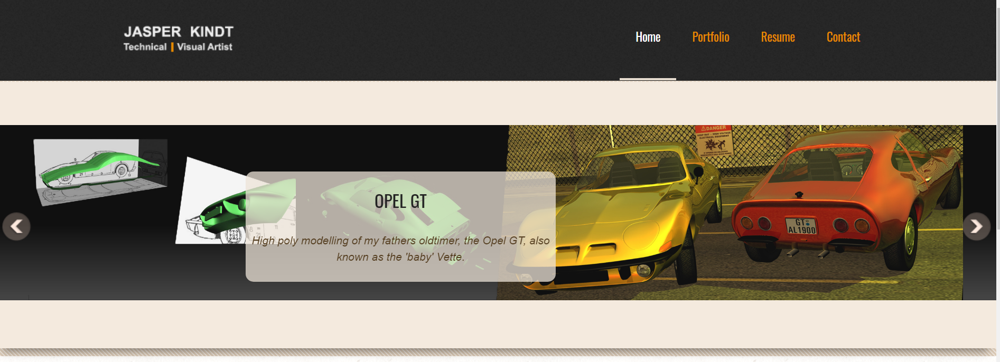

# Les 4: Structuur en navigatie in HTML

## 4.1 Hyperlinks maken

(dit is een herhaling van 3.4 uit [LES 3](../les_03/README.md))

Hyperlinks zijn heel belangrijk – ze maken van het web _een Web_. Deze les toont de vereiste syntaxis voor het maken van een koppeling en bespreekt de beste werkwijzen om met koppelingen te werken.

Vereisten: | Basiskennis van HTML, zoals beschreven in [Beginnen met HTML](https://developer.mozilla.org/nl/docs/Learn/HTML/Introduction_to_HTML/Getting_started). Kennis over HTML-tekstopmaak, zoals beschreven in [Grondbeginselen van HTML-tekst](https://developer.mozilla.org/nl/docs/Learn/HTML/Introduction_to_HTML/HTML_text_fundamentals).
---------- | ---------------------------------------------------------------------------------------------------------------------------------------------------------------------------------------------------------------------------------------------------------------------------------------------------------------------------------------
Doel:      | U leert hoe je een hyperlink op een doeltreffende manier aan uw inhoud kunt toevoegen en meerdere bestanden met elkaar kunt verbinden.                                                                                                                                                                                                  

### Wat is een hyperlink?

Hyperlinks zijn een van de meest opwindende vernieuwingen die het web ons biedt. Eigenlijk horen ze er al sinds het allereerste begin bij, maar zij zijn wat van het web _een Web_ maakt - hiermee kunnen we onze documenten met andere documenten (of met een andere informatiebron) verbinden. Ook kunnen we specifieke onderdelen van documenten met elkaar verbinden, en we kunnen apps op een eenvoudig webadres beschikbaar maken (in tegenstelling tot ‘native’ apps, die op voorhand moeten worden geïnstalleerd). Bijna alle webinhoud kan in een koppeling worden omgezet, zodat wanneer hierop wordt geklikt (of deze op een andere manier wordt geactiveerd), de webbrowser naar een ander webadres zal gaan ([URL](https://developer.mozilla.org/en-US/docs/Glossary/URL).)

**Noot**: een URL wijst ook naar HTML-bestanden, tekstbestanden, afbeeldingen, tekstdocumenten, video- en audiobestanden en alles wat er op het web kan leven. Als de browser niet weet hoe deze het bestand moet weergeven of behandelen, zal worden gevraagd of je het bestand wilt openen of downloaden (in dat geval kun je er later uw ding mee doen). Als je wordt gevraagd het bestand te openen, wordt de verantwoordelijkheid voor die taak doorgegeven naar een geschikte systeemeigen app op het apparaat.

De startpagina van deze portfolio bijvoorbeeld bevat een aantal koppelingen die naar verschillende gebieden van de website gaan; Home, Portfolio, Resume, Contact...



### Anatomie van een koppeling

Een eenvoudige koppeling wordt gemaakt door de tekst (of andere inhoud, zie [Koppelingen op blokniveau](https://developer.mozilla.org/nl/docs/Learn/HTML/Introduction_to_HTML/Hyperlinks_maken#Koppelingen_op_blokniveau)) die je in een koppeling wilt omzetten binnen een [`<a>`](https://developer.mozilla.org/nl/docs/Web/HTML/Element/a "Het HTML <a> element (of anker element) maakt een hyperlink naar andere web pagina's, bestanden, lokaties binnen dezelfde pagina, email-adressen of een andere URL.")-element op te nemen, en dat element een `[href](https://developer.mozilla.org/nl/docs/Web/HTML/Element/a#attr-href)`-attribuut te geven (ook bekend als een **Hypertext Reference** of **target**) dat het webadres zal bevatten waarnaar je de koppeling wilt laten wijzen.

```HTML
<p>Ik ben een koppeling naar
<a href="https://www.mozilla.org/nl/">de Mozilla-startpagina</a> aan het maken.
</p>
```

Dit geeft het volgende resultaat:

Ik ben een koppeling naar [de Mozilla-startpagina](https://www.mozilla.org/nl/) aan het maken.

### Ondersteunende informatie toevoegen met het title-attribuut

Een andere attribuut dat je mogelijk aan uw koppelingen wilt toevoegen is `title`; dit is bedoeld voor extra nuttige informatie over de koppeling, zoals het type informatie dat de pagina bevat, of zaken waarvan je zich bewust moet zijn. Voorbeeld:

```HTML
<p>Ik ben een koppeling naar
<a href="https://www.mozilla.org/nl/"
   title="De beste plek om meer informatie over Mozilla’s
          missie te vinden en hoe je daaraan kunt bijdragen">de Mozilla-startpagina</a> 
aan het maken.</p>
```

De code hierboven zorgt ervoor dat de title als een tooltip verschijnt als je de muisaanwijzer boven een koppeling houdt:

Ik ben een koppeling naar [de Mozilla-startpagina](https://www.mozilla.org/nl/ "De beste plek om meer informatie over Mozilla’s missie te vinden en hoe je daaraan kunt bijdragen") aan het maken.

**Noot**: een hyperlink-titel zal alleen verschijnen als je de muis erboven houdt. Dit betekent dat mensen die een toetsenbord gebruiken om in een webpagina te navigeren moeite zullen hebben om de informatie in de tooltip te lezen. Als de informatie van een titel echt nodig is om de pagina te kunnen gebruiken, zou je die moeten aabieden op een manier die voor alle gebruikers toegankelijk is. U kunt de informatie bijvoorbeeld in de normale tekst van de webpagina zetten.

### Actief leren: uw eigen voorbeeldkoppeling maken

Hebben we al gedaan in Les 3

[oefening](https://codepen.io/GoldFlow/pen/PoGqxpV)

### Koppelingen op blokniveau

We hebben al vermeld dat je ongeveer alle inhoud in een hyperlink kunt omzetten, zelfs [elementen op blokniveau](https://developer.mozilla.org/nl/Learn/HTML/Introduction_to_HTML/Getting_started#Blok-_versus_inline-elementen). Als je een afbeelding in een koppeling zou willen omzetten, kon je die afbeelding gewoon tussen `<a></a>`-labels zeten.

```HTML
<a href="https://www.mozilla.org/nl/">
  
</a>
```

**Noot**: in een latere les zul je nog veel meer over het gebruik van afbeeldingen op het web ontdekken.

## 4.2 Een snelle uitleg over URL’s en paden

Om het doel van een hyperlink volledig te begrijpen, moet je URL’s en bestandspaden begrijpen. Deze sectie verschaf je de informatie die je daarvoor nodig hebt.

Een URL, of Uniform Resource Locator, is gewoon een string (tekst) die bepaalt waar iets op het web kan worden gevonden. Mozilla’s Nederlandstalige startpagina bijvoorbeeld bevindt zich op `https://www.mozilla.org/nl/`.

URL’s gebruiken paden om bestanden te vinden. Paden tonen ons waar een bestand zich in een bestandssysteem bevindt. Laten we een eenvoudig voorbeeld van een mapstructuur bekijken (zie de map [creating-hyperlinks](https://github.com/mdn/learning-area/tree/master/html/introduction-to-html/creating-hyperlinks).)


Je kan het project [hier downloaden](creating-hyperlinks.zip)

In onderstaande video leg ik uit hoe je het project kan extracten / openen op je computer:

<video width="600" controls>
<source src="hoe-project-extracten.mkv">
</video>

De **hoofdmap** van deze mapstructuur heet `creating-hyperlinks`. Als je op uw lokale computer aan een website werkt, zul je een map hebben waarbinnen de volledige website zich bevindt. In de hoofdmap hebben we een bestand `index.html` en een `contacts.html`. Op een echte website zou `index.html` onze startpagina of landingspagina zijn (een webpagina die als het startpunt voor een website of een bepaalde sectie van een website dient).

In onze hoofdmap zitten ook twee andere mappen – `pdfs` en `projects`. In elk van hen steekt één bestand – respectievelijk een PDF-bestand (`project-brief.pdf`) en een `index.html-bestand`. Twee `index.html`-bestanden kunnnen dus heel goed in één project bestaan, zolang ze op verschillende locaties in het bestandsysteem zijn opgeslagen. Bij veel websites is dit het geval. De tweede `index.html` is misschien de landingspagina voor projectgerelateerde informatie. (Tussen haakjes: een **landingspagina** is een pagina op uw website die specifiek is ingericht voor bezoekers die op die pagina binnenkomen (landen). De bezoeker kan op uw pagina landen via een zoekopdracht of bijvoorbeeld een online- of offlinecampagne die hem of haar naar die specfieke pagina stuurt.)

* **Dezelfde map**: stel dat je een hyperlink aan het bestand `index.html` op het hoogste niveau wilt toevoegen. De hyperlink in deze index.html wijst naar `contacts.html.` U hoeft dan alleen de bestandsnaam van het bestand waarnaar je wilt verwijzen op te geven, omdat dit zich in dezelfde map bevindt als het huidige bestand. De URL is dus gewoon `contacts.html`:

    ```
    <p>Wil je contact opnemen met een staflid?
    Details vind je op onze <a href="contacts.html">contactpagina</a>.</p>
    ```

* **Afdalen naar submappen**: stel dat je opnieuw een hyperlink aan het bestand `index.html` in de hoofdmap wilt toevoegen, maar deze keer wijst de hyperlink naar `projects/index.html`. In dat geval zou je omlaag naar de map `projects` moeten gaan voordat je het bestand aangeeft waarnaar je wilt verwijzen. Dit doe je door eerst de naam van de map te noteren, dan een voorwaartse schuine streep te schrijven, en dan de naam van het bestand. De URL zal er dus zo uitzien: `projects/index.html`:

    ```HTML
    <p>Bezoek mijn <a href="projects/index.html">project-startpagina</a>.</p>
    ```

* **Teruggaan naar bovenliggende mappen**: als je een hyperlink in `projects/index.html` wilt plaatsen en je wilt dat die koppeling naar `pdfs/project-brief.pdf` wijst, moet je een niveau omhoog gaan, en dan opnieuw omlaag naar de map `pdf`. ‘Naar een bovenliggende map gaan’ wordt aangegeven via twee puntjes – `..` – dus de te gebruiken URL is `../pdfs/project-brief.pdf`:

    ```HTML
    <p>Een hyperlink naar mijn <a href="../pdfs/project-brief.pdf">projectsamenvatting</a>.</p>
    ```

Hier leg ik uit hoe je een submap kan linken:

<video width="600" controls>
<source src="submap-links.mkv">
</video>

**Noot**: zo nodig kun je meerdere instanties van deze eigenschappen in complexe URL’s combineren, bijvoorbeeld `../../../complex/pad/naar/mijn/bestand.html`.

### Documentfragmenten

Het is mogelijk om naar een specifiek deel van een HTML-document te verwijzen. Dit specifieke deel noemen we een **documentfragment**. Om dit te doen heb je een `[id](https://developer.mozilla.org/nl/docs/Web/HTML/Global_attributes#attr-id)`-attribuut nodig. U moet het toekennen aan het element waarnaar je uw hyperlink wilt laten wijzen. Het is meestal zinvol om er een geschikte kop voor te gebruiken. Die kop zal er ongeveer zo uitzien:

```HTML
<h2 id="E-mailadres">E-mailadres</h2>
```

Om dan naar dat specifieke `id` te verwijzen, voeg je de inhoud van het id aan het einde van de URL toe, voorafgegaan door een hekje (#). Voorbeeld:

```HTML
<p>Wil je ons een brief schrijven? Gebruik dan ons <a href="contacts.html#e-mailadres">e-mailadres</a>.</p>
```

U kunt het documentfragment zelfs aan _een ander deel van hetzelfde document_ koppelen:

```HTML
<p>Het<a href="#e-mailadres">e-mailadres van ons bedrijf</a> vind je onderaan de pagina.</p>
```

### Absolute versus relatieve URL’s

Twee termen die je op het web zult tegenkomen zijn **absolute URL** en **relatieve URL:**

**Een absolute URL** wijst naar de absolute locatie op het web. Die locatie houdt ook het [protocol](https://developer.mozilla.org/nl/docs/Glossary/Protocol) en de [domain name](https://developer.mozilla.org/en-US/docs/Glossary/domain_name) in. Stel bijvoorbeeld dat een pagina `index.html` wordt geüpload naar een map die `projects` heet. Als die zich in de hoofdmap (root in het Engels) van een webserver bevindt en het domein van de website is `http://www.example.com`, zou je de pagina op `http://www.example.com/projects/index.html` kunnen vinden. (Of zelfs alleen `http://www.example.com/projects/`, want de meeste webservers zoeken naar een landingspagina zoals `index.html` die ze kunnen laden als deze niet in de URL wordt vermeld.)

Een absolute URL zal altijd naar dezelfde locatie wijzen, waar deze ook wordt gebruikt.

**Een relatieve URL** wijst naar een locatie die _relatief_ is ten opzichte van het bestand vanwaar je verwijst. De koppeling ziet eruit zoals de URL’s die we in de vorige sectie hebben bekeken. Als je bijvoorbeeld een koppeling van ons voorbeeld `http://www.example.com/projects/index.html` naar een PDF-bestand in dezelfde map wilt maken, zou de URL alleen uit de bestandsnaam bestaan – bv. `project-brief.pdf` – extra informatie is dan niet nodig. Als de PDF beschikbaar was in de submap binnen `projects` met de naam `pdfs`, zou de relatieve koppeling `pdfs/project-brief.pdf` zijn (de equivalente absolute URL zou er dan zo uitzien: `http://www.example.com/projects/pdfs/project-brief.pdf`).

Een relatieve URL kan naar verschillende plekken wijzen, afhankelijk van de locatie van het bestand waarin de koppeling wordt vermeld zich bevindt. Als we bijvoorbeeld ons bestand `index.html` uit de map `projects` zouden halen en dit in de hoofdmap van de website zouden plaatsen (het hoogste niveau, geen submappen), zou `pdfs/project-brief.pdf` nu naar `http://www.example.com/pdfs/project-brief.pdf` wijzen en niet naar `http://www.example.com/projects/pdfs/project-brief.pdf`.

## 4.3 Optimale methoden voor het werken met koppelingen

Er bestaan een aantal ‘beste werkwijzen’ die je kunt volgen als je een hyperlink maakt. Die werkwijzen gaan we hieronder bekijken.

### Verwoord uw koppelingen duidelijk

Het is makkelijk om een paar koppelingen op uw pagina te plaatsen, maar dat is niet genoeg. We moeten onze hyperlinks _toegankelijk_ maken voor alle lezers, ongeacht hun huidige context en hulpmiddelen van hun voorkeur. Voorbeeld:

* Mensen die een schermlezer gebruiken, springen graag van koppeling naar koppeling en lezen die zonder op de context in te gaan.
* Zoekmachines gebruiken hyperlinktekst om doelbestanden te indexeren. Het is dus een goed idee om sleutelwoorden in uw koppelingstekst te gebruiken. Deze sleutelwoorden beschrijven de plek waar de koppeling je naartoe brengt.
* Visuele lezers scannen de tekst in plaats van elk woord te lezen en hun blik zal op pagina-eigenschappen worden gericht die er echt uitspringen, zoals koppelingen. Ze zullen de beschrijvende tekst in een koppeling nuttig vinden.

We bekijken een specifiek voorbeeld:

_**Goede** koppelingstekst:_ [Download Firefox](https://firefox.com/)

```HTML
<p><a href="https://firefox.com/">
  Download Firefox
</a></p>
```

_**Slechte** koppelingstekst:_ [Klik hier](https://firefox.com/) om Firefox te downloaden

```HTML
<p><a href="https://firefox.com/">
  Klik hier
</a>
om Firefox te downloaden</p>
```

Andere tips:

* Herhaal de URL niet als onderdeel van de koppelingstekst – URL’s zijn lelijk en klinken nog lelijker als ze letter voor letter door een schermlezer worden voorgelezen.
* Zeg niet ‘koppeling’ of ‘verwijst naar’ in de koppelingstekst – dit is alleen maar ruis. Schermlezers vertellen gebruikers dat er een koppeling is. Visuele gebruikers zullen weten dat er een koppeling staat, omdat een koppeling standaard wordt onderstreept en ook in een andere kleur zal staan. (Deze conventie kan dus beter niet worden doorbroken, want gebruikers zijn eraan gewend.)
* Houd uw koppelingstekst zo kort mogelijk – lange koppelingen irriteren schermlezergebruikers nog het meest, omdat die naar het hele verhaal moeten luisteren.
* Minimaliseer het gebruik van meerder kopieën van dezelfde tekst die naar verschillende plaatsen wordt verwezen. Dit kan problemen veroorzaken bij gebruikers van schemrlezers, want zij zullen een koppelingen vaker buiten de context ervan lezen – diverse koppelingen met het label ‘klik hier’, ‘klik hier’, ‘klik hier’ zouden verwarrend zijn.

### Gebruik relatieve koppelingen waar mogelijk

Als je de beschrijving hierboven leest, denk je misschien dat het een goed idee is om altijd absolute koppelingen te gebruiken. Ze kunnen niet defact raken als een pagina van plaats verandert, en relatieve koppelingen zullen dat wel doen. Niettemin is het beter een relatieve koppeling te gebruiken waar dat mogelijk is als je naar locaties _op dezelfde website_ verwijst (Als je naar _een andere website_ verwijst, zul je een absolute koppeling nodig hebben):

* Ten eerste is het veel makkelijker om uw code te scannen – relatieve URL’s zijn in het algemeen veel korter dan absolute URL’s, wat het lezen van code veel makkelijker maakt.
* Ten tweede is het gebruik van relatieve URL’s veel efficiënter. Als je een absolute URL gebruikt, zoekt de browser eerst de echte locatie van de server op door de domeinnaam op de [DNS](https://developer.mozilla.org/nl/docs/Glossary/DNS)-server op te zoeken, vervolgens gaat de browser naar de server waar het bestand zich op bevindt, en pas daarna vindt deze het gevraagde bestand. Een relatieve URL laat de browser naar het gevraagde bestand op dezelfde server zoeken. Als je dus absolute URL’s gebruikt waar relatieve URL’s voldoende zijn, laat je uw browser constant extra werk doen, wat betekent dat deze minder efficiënt werkt.

### Koppelingen naar browservreemde bronnen – gebruik duidelijke wegwijzers

Als je hyperlinks schrijft naar een bron die men downloadt (zoals een PDF- of Word-document), streamt (zoals video of audio) of die een ander potentieel onverwacht effect heeft (een pop-upvenster opent of een Flash-film laadt), voeg dan duidelijke bewoording toe om elke verwarring te vermijden. Het kan zeer bijvoorbeeld zeer vervelend worden:

* Als je een lage bandbreedte hebt, op een koppeling klikt en er onverwacht een download van een meerdere megabytes begint.
* Als je Flash Player niet hebt geïnstalleerd, op een koppeling klikt en je plotseling naar een pagina wordt gebracht die Flash vereist.

Laten we een paar voorbeelden bekijken en wat voor tekst we in dit soort gevallen kunnen gebruiken:

```HTML
<p><a href="http://www.example.com/large-report.pdf">
  Het omzetrapport downloaden(PDF, 10MB)
</a></p>

<p><a href="http://www.example.com/video-stream/">
  De video bekijken (stream opent in apart tabblad, HD-kwaliteit)
</a></p>

<p><a href="http://www.example.com/car-game">
  Het autospel spelen (vereist Flash-software)
</a></p>
```

### Gebruik het download-attribuut als je naar een download verwijst

Als je een koppeling naar een bron schrijft die beter kan worden gedownload dan deze in de browser te openen, kun je het `download`-attribuut gebruiken en de koppeling een standaard bestandsnaam geven om de download mee op te slaan. Hier is een voorbeeld met een downloadkoppeling naar de Windows-versie van Firefox 39:

```HTML
<a href="https://download.mozilla.org/?product=firefox-39.0-SSL&os=win&lang=nl"
   download="firefox-39-installer.exe">
  Download Firefox 39 voor Windows
</a>
```

## 4.4 OPDRACHT: een navigatiemenu maken

Voor deze oefening willen we dat je een paar pagina’s naar elkaar laat verwijzen met een navigatiemenu. Zo kun je een website maken die uit meerdere pagina’s bestaat. Dit is een gebruikelijke manier – dezelfde paginastructuur wordt op elke pagina herhaald, inclusief het navigatiemenu. Als je dus op de koppelingen klikt, heb je de indruk dat je op dezelfde plek blijft en dat er verschillende inhoud wordt getoond.

U hebt lokale kopieën van de volgende vier pagina’s nodig, alle vier in dezelfde map (zie ook de map [navigation-menu-start](https://github.com/mdn/learning-area/tree/master/html/introduction-to-html/navigation-menu-start) voor een volledige lijst):

* [index.html](https://github.com/mdn/learning-area/blob/master/html/introduction-to-html/navigation-menu-start/index.html)
* [projects.html](https://github.com/mdn/learning-area/blob/master/html/introduction-to-html/navigation-menu-start/projects.html)
* [pictures.html](https://github.com/mdn/learning-area/blob/master/html/introduction-to-html/navigation-menu-start/pictures.html)
* [social.html](https://github.com/mdn/learning-area/blob/master/html/introduction-to-html/navigation-menu-start/social.html)

[Download hier de zip file van de 4 bovenstaande bestanden om te beginnen aan de oefening.](../basis/navigation-menu-start.zip)

Wat je moet doen:

1.  Voeg een ongeordende lijst toe op de aangegeven plek op één pagina, die de namen bevat van de pagina’s waarnaar wordt verwezen. Een navigatiemenu is gewoonlijk niet meer dan een lijst met koppelingen, dus semantisch gezien is dit in orde.
2.  Zet alle paginanamen om naar een hyperlink naar die pagina.
3.  Kopieer het navigatiemenu naar de drie andere pagina’s.
4.  Op elke pagina verwijder je de koppeling naar zichzelf – dat is alleen maar verwarrend en zinloos, en het ontbreken van een koppeling is een goede visuele herinnering aan de pagina waarop je zich nu bevindt.

Het voltooide voorbeeld zou er ongeveer zo moeten uitzien:


**Noot**: als je vastloopt, of er niet zeker van bent dat je het allemaal juist hebt, kun je de map [navigation-menu-marked-up](https://github.com/mdn/learning-area/tree/master/html/introduction-to-html/navigation-menu-marked-up) bekijken om het juiste antwoord te zien.

## 4.5 E-mailkoppelingen

Het is mogelijk om koppelingen of knoppen te maken die een nieuwe e-mailbericht openen, als erop wordt geklikt. Dit is mogelijk door het gebruik van het [`<a>`](https://developer.mozilla.org/nl/docs/Web/HTML/Element/a "Het HTML <a> element (of anker element) maakt een hyperlink naar andere web pagina's, bestanden, lokaties binnen dezelfde pagina, email-adressen of een andere URL.")-element en het URL-schema `mailto:`.

In de meest eenvoudige en gebruikelijke vorm duidt een ‘`mailto:`-koppeling’ gewoon het e-mailadres van de bedoelde ontvanger aan. Voorbeeld:

```HTML
<a href="mailto:nowhere@mozilla.org">E-mail nergens naartoe verzenden</a>
```

Het resultaat is een koppeling die er zo uitziet: [E-mail nergens naartoe verzenden](mailto:nowhere@mozilla.org).

In feite is het e-mailadres zelfs optioneel. Als je het weglaat (dat wil zeggen, uw `[href](https://developer.mozilla.org/nl/docs/Web/HTML/Element/a#attr-href)` is gewoon "mailto:"), zal een nieuw venster voor uitgaande e-mail worden geopend door het e-mailprogramma van de gebruiker waarin nog geen bestemmingsadres is ingevuld. Dit is vaak nuttig voor het ‘Delen’ van koppelingen waarop gebruikers kunnen klikken om een e-mailbericht naar een zelfgekozen e-mailadres te sturen.

### Details toevoegen

Behalve het e-mailadres kun je nog andere informatie toevoegen. In feite kunnen alle kopregels van een standaardmail worden toegevoegd aan de `mailto`-URL die je opgeeft. De meest gebruikelijke zijn ‘subject’ (onderwerp), ‘cc’, en ‘body’ (body is de inhoud, body is geen echt headerveld, maar je kunt er een korte inhoud van het nieuwe e-mailbericht mee opgeven). Elk veld en de waarde ervan wordt als zoekterm opgegeven.

Hier is een voorbeeld met cc, bcc, subject en body:

```HTML
<a href="mailto:nowhere@mozilla.org?cc=name2@rapidtables.com&bcc=name3@rapidtables.com&amp;subject=The%20subject%20of%20the%20email &amp;body=The%20body%20of%20the%20email">
  E-mail verzenden met cc, bcc, subject en body
</a>
```

**Noot:** de waarden van elk veld moeten URL-gecodeerd zijn, d.w.z. met niet-afdrukbare tekens (onzichtbare tekens zoals tabs, enters en pagina-einden) en spaties [‘percent-escaped’](http://en.wikipedia.org/wiki/Percent-encoding)). Let ook op het gebruik van het vraagteken (`?`) om de hoofd-URL van de ingevoerde waarden te scheiden, en de ampersand (&) om de velden in de `mailto:`-URL van elkaar te scheiden. Dit is standaard URL-zoeknotatie. U kunt de [De GET-methode](https://developer.mozilla.org/nl/docs/Learn/HTML/Forms/Sending_and_retrieving_form_data#De_GET-methode) lezen als je meer over URL-querynotatie wilt weten.)

Dit zijn enkele voorbeelden van `mailto`-URL’s:

* mailto:
* mailto:nowhere@mozilla.org
* mailto:nowhere@mozilla.org,nobody@mozilla.org
* mailto:nowhere@mozilla.org?cc=nobody@mozilla.org
* mailto:nowhere@mozilla.org?cc=nobody@mozilla.org&subject=Dit%20is%20het%20onderwerp


# 4.6 Hoe de theorie toepassen in Visual Code

#### Hoe een nieuw html bestand te maken

<video width="600" controls>
<source src="nieuw-html-bestand.mkv">
</video>

#### Hoe een project extracten op je computer

<video width="600" controls>
<source src="hoe-project-extracten.mkv">
</video>

#### Hoe link maken in Visual Studio Code

<video width="600" controls>
<source src="maak-hyperlink.mkv">
</video>

#### Hoe intellisense gebruiken in Visual Studio Code

<video width="600" controls>
<source src="href-maken-intellisense.mkv">
</video>


#### Hoe submap links te maken

<video width="600" controls>
<source src="submap-links.mkv">
</video>